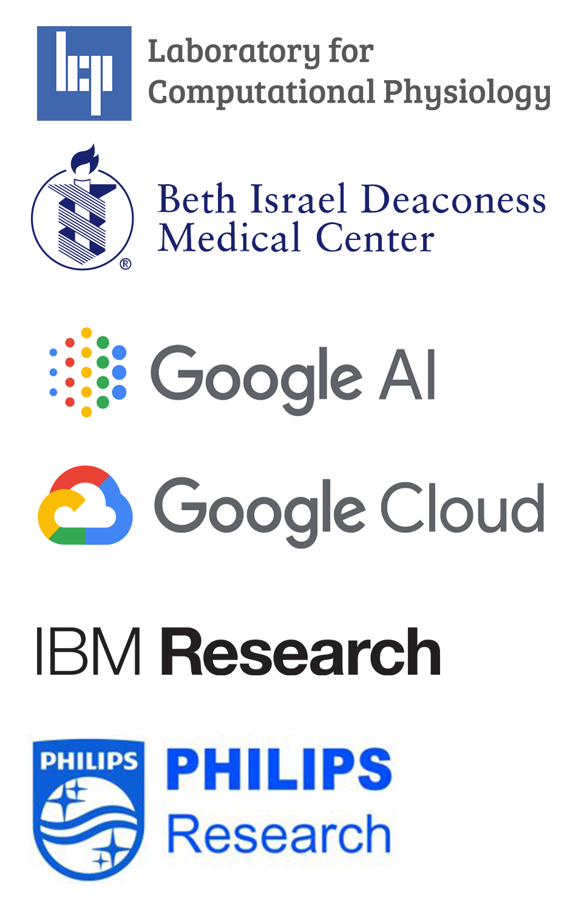

+++
title = "MIT-LCP Clinical Data Consortium"
date = "2019-04-01T12:00:00-04:00"
description = "Annual Meeting"
identifier = "Consortium"
keywords = ["Consortium"]
banner = "img/blog/data.jpg"

+++

<h3>Join us for the 2020 Annual Meeting</h3>

The MIT-LCP Clinical Data Consortium is a unique organization engaging in advancing health data analytics research through interdisciplinary industry-academic collaboration. This association of scientist, clinician, and industry leaders are devoted to building and curating uniquely powerful open health datasets, accelerating the discovery of novel machine learning models and applications focused on quality improvements in health outcomes.

The Laboratory for Computational Physiology is organizing our 2nd Annual Clinical Data Consortium Meeting, to be held April 21-22.  This two-day event will bring together all participating Consortium Members and LCP research partners and affiliates who are engaged in building health datasets and/or performing health data analysis. During this meeting, we will present recent consortium developments and discuss plans for the upcoming year.  

<table class="table table-striped panel-primary">
  <tr><th></th><th>Member Action Items</th></tr>
  <tr><td align="right">
    <strong>Agenda</strong>
  </td><td>
  Tentative schedule below. 
  We attempted to accommodate as many members as possible. 
  If you are only able to attend a <em>single day</em>, we would recommend the morning of April 22, which would include the steering committee meeting and discussions about future directions.
  </td></tr>
  <tr><td align="right">
    <strong>RSVP</strong>
  </td><td>
  Please let us know how many attendees will be coming form your organization. 
  Complete the <a href="https://forms.gle/3uvXELJaXYbpSWXq7" target="blank">RSVP form</a> to note attendees and dietary restrictions 
  </td></tr>
  <tr><td align="right" >
    <strong>Presentation Topic</strong>
  </td><td>
  Each member will have the opportunity to present on their work from their research. 
  Please let us know who will be speaking from your organization and the specific <em>title of the talk</em>. 
  There is an entry on the <a href="https://forms.gle/3uvXELJaXYbpSWXq7" target="blank">RSVP form</a>, or email us directly.
  </td></tr>
</table>

<h3>Details</h3>
<h4>Date: April 21-22, 2020</h4>
<h4>Location: MIT, <a href="http://whereis.mit.edu/?go=e25" target="blank">TBD</a></h4>

Note: There is significant construction in the area which may delay your commute

<h3>Tentative Meeting Schedule</h3>


